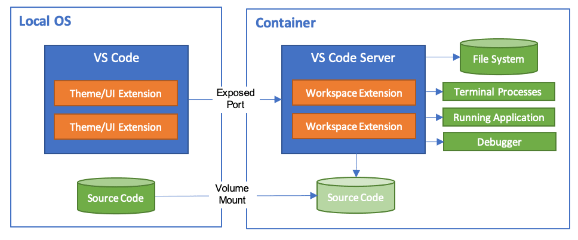

# Shenzhen_innoX_2024wc_ws

## 更新说明

镜像仓库地址：https://hub.docker.com/repository/docker/wzx1210/innox2024_wc

| 时间 | tag | 说明 |
| --------- | ------ | ------------------------------------------------------------------------- |
| 2024.1.17 | wzx1210/innox2024_wc:v1.0.1 | 更新镜像支持可视化展示、支持"/dev/robomaster"（未测试）、支持"/dev/video"（未测试）|
| 2024.1.18 | wzx1210/innox2024_wc:v1.0.2 | 安装缺少库，支持摄像头 |
| 2024.1.24 | wzx1210/innox2024_wc:v1.0.3 | 安装putty等串口调试工具 |
| 2024.1.24 | wzx1210/innox2024_wc:v1.0.4 | 安装串口库 |

| 2024.1.24 | wzx1210/innox2024_wc:v2.0.0 | 【弃用】基础镜像：arm64v8/ubuntu:focal |
| 2024.1.24 | wzx1210/innox2024_wc:v2.0.1 | 【弃用】更换系统源，安装ros，安装python并换源，修改系统时区，安装git、vim，putty等常用工具 |
| 2024.1.24 | wzx1210/innox2024_wc:v2.0.2 | 【弃用】配置工作空间环境 |
| 2024.1.24 | wzx1210/innox2024_wc:v2.0.3 | 【弃用】支持可视化 |

| 时间 | tag | 说明 |
| --------- | ------ | ------------------------------------------------------------------------- |
| 2024.1.26 | registry.cn-hangzhou.aliyuncs.com/wzx1210/innox2024_wc:v3.0.0 |  ros基础镜像|
| 2024.1.26 | registry.cn-hangzhou.aliyuncs.com/wzx1210/innox2024_wc:v3.0.1 |  更新配置

## 环境说明

- Docker-Image: wzx1210/innox2024_wc:v1.0.1
- Ubuntu 20.04
- Ros Neotic 
- Mamba
- vscode-plugin: cmake / ros / c++ / python
- docker-network-mode: bridge

## 环境测试

|          | Linux | Windows                     | PI | Macos |
| -------- | ----- | --------------------------- | -- | ----- |
| 测试镜像 | wzx1210/innox2024_wc:v1.0.2      | wzx1210/innox2024_wc:v1.0.1 | registry.cn-hangzhou.aliyuncs.com/wzx1210/innox2024_wc:v3.0.1   |       |
| 可以启动 | √    | √                          |   √  |       |
| 可视化   | √     | √                          |  √   |       |
| 硬件通讯（USB_CAM） | √     | ×                          |  √   |       |
| 硬件通讯（下位机） |  √      |                           |  √   |       |

## workflow

如果你有兴趣可以阅读以下内容，也可以直接跳过



1. 使用devcontainer作为开发环境。 https://containers.dev/
   1. devcontainer的一个特征是将代码的运行环境与代码本身完全隔离开来，在效果上类似将workspace挂载到了容器中。
   2. 在docker-image中仅仅包含有关系统的配置（例如修改baserc或安装依赖包等），其本身不存储任何项目代码和工作空间，做到了代码与环境的完全隔离
   3. 可以通过devcontainer.json配置文件，快速修改和分发容器配置。
   4. 与vscode深度融合，一键启动，无需任何命令

# OrangePi (营期使用)
1. 在你的电脑上安装vscode
   https://code.visualstudio.com/
2. 打开vscode,并安装remote SSH插件
   
3. 远程连接Pi
   
4. 在Pi中克隆工作空间
   ```bash
   git clone https://github.com/RM-camp-for-high-school-students/Shenzhen_innoX_2024wc_ws.git
   ```
5. 在vscode中打开刚刚克隆的工作空间工作空间
   

# X86
## 环境准备

理论上支持任何可以安装以下准备环境的平台（arm平台未测试），如：Windows、Linux（如需连接硬件请使用linux）、MacOS

1. 安装docker
   1. 如果安装的是Docker Desktop，请在使用前启动Docker Engine
2. 安装vscode
3. 在vscode中安装devcontainer插件
   1. 建议保持版本一致 v0.299.0

## 使用教程

1. 克隆目录：在**本地宿主机**的合适目录克隆代码

   ```bash
   git clone https://github.com/RM-camp-for-high-school-students/Shenzhen_innoX_2024wc_ws.git
   git checkout docker
   vscode .
   ```
2. 构建开发容器：在vscode中打开项目目录  -> 按 "Ctrl + Shift + P" 打开命令面板 -> 输入"Rebuild and Reopen in Container"构建开发容器。
   注意：
      1. 首次拉取镜像可能需要较长时间，你可以双击vscode右下角的通知消息查看当前log
      2. 请根据宿主机电脑的设置配置 .devcontainer.json 中的硬件设备，如配置错误则无法成功构建开发容器
   
3. 进入开发容器：等待镜像下载完成后，开发容器会自动构建并运行。此时左下角会显示【Shenzhen-innoX-2024wc】，表面已进入开发容器。
   
4. 编译工作空间：在vscode中的**开发容器终端**中运行以下命令

   ```bash
   catkin_make -DPYTHON_EXECUTABLE=/usr/bin/python3
   source ~/.bashrc
   ```
5. 启动可视化：依次点击"端口选项卡" -> "desktop(6090)" 后的小地球 -> "输入密码vscode"，即可进入简易图形化系统界面
   
6. 测试可视化正常：运行以下命令，并观察是否可视化显示

   ```bash
   roslaunch map_server innox2024_wc.launch
   ```
   

## 下位机通讯


wzx1210

2023.1.18
